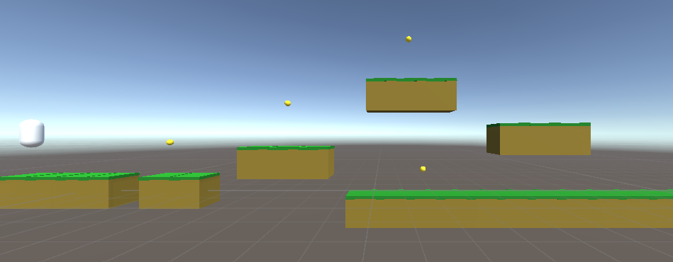

# Hack Technology / Project Attempted

## What you built? 

I attempted to build a simple game in Unity3d!

I then added in coins which give the player superjump abilities!

## Who Did What?

I worked on all of it!

## What you learned

Unity was really fun to learn! I'm currently in a 3d digital modeling class and I previously have taken CS77 (computer graphics) and unity felt like a fun mix of those two classes! One thing I really liked about this tutorial was that he put in an emphasis on good coding habits and showed multiple ways to fix common bugs and explained the pros and cons to the various methods. I thought Unity had a really easy and intuitive UI, which made me want to keep playing around after I finished my tutorial!  

However, in his scripts there seemed to be way more automatic guessing of what was happening. I'm not sure if this was because it was my first time coding with Unity / C# so computer doesn't yet recognize the built-in functions yet?  

I've wanted to get into game design for a while now, so it was really fun to work on this project. This has helped me realize that I would definitely find it fulfilling to work on a project that is game-based. I really enjoyed the de-bugging process and adding in additional features. 

## Authors

Katherine Taylor

## Acknowledgments

I follows the following tutorial: https://www.youtube.com/watch?v=pwZpJzpE2lQ 
