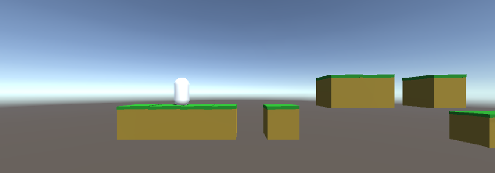

# Hack Technology / Project Attempted

## What you built? 

I attempted to build a simple game in Unity3d!

[How?](https://help.github.com/articles/about-readmes/#relative-links-and-image-paths-in-readme-files)

## Who Did What?

I worked on all of it!

## What you learned

TODO: what worked / what didn't work
taught good coding habits (ex: using getComponent minimally)
really easy and intuitive to use UI
In his scripts there seemed to be way more automatic guessing of what was happening. I'm not sure if this was because it was my first time coding with Unity / C# so computer doesn't recognize the built-in functions yet?

## Authors

TODO: list of authors

## Acknowledgments

TODO: cite any tutorials followed here
